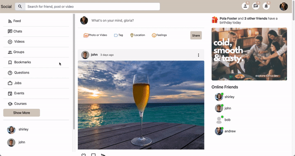
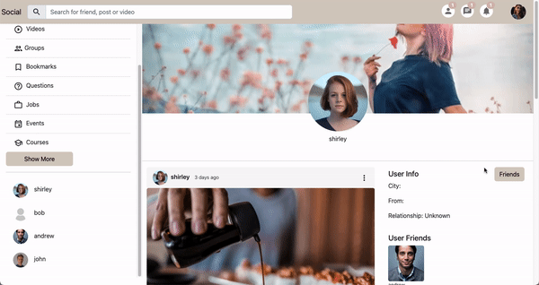
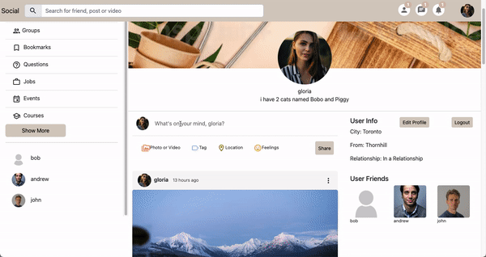
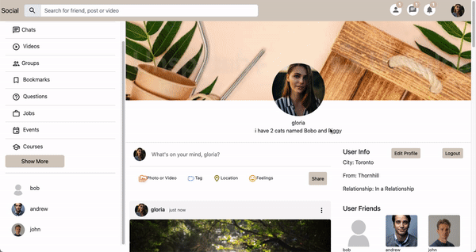
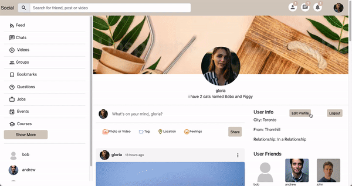
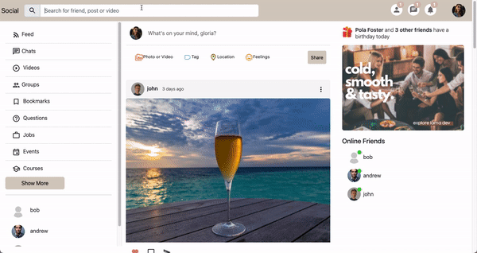
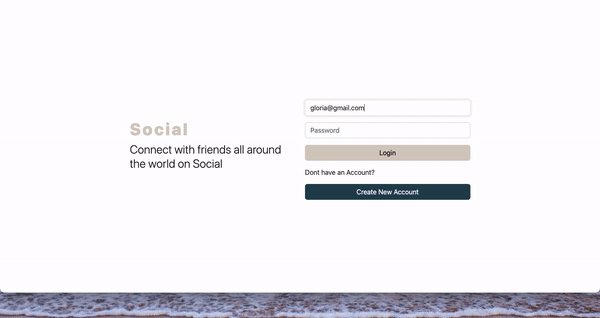
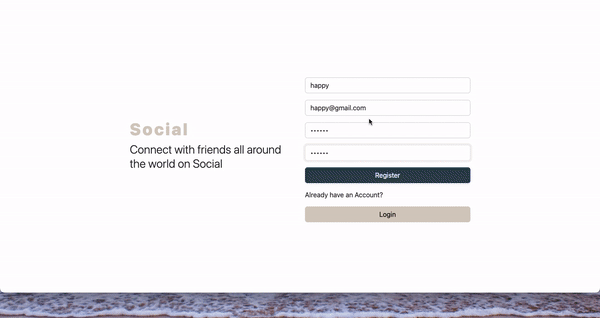

# Social Media App

Social is a social networking app that allows users to connect and share posts with friends and family. This full stack app was created with ReactJS for client side and NodeJS, Express and MongoDB for server side. 

## Final Product

### Overview

### Follow / Unfollow Another User

### Create New Post

### Delete Post

### Like / Dislike Post

### Edit Profile

### Search for User

### Login / Logout

### Register

## Setup

- Create account with [Firebase](https://firebase.google.com/), start a new project and register the web app
- Set up .env file using .env.example file for firebase configuration in client directory
- Create account with [MongoDB](https://cloud.mongodb.com/), start a new project and create new cluster
- Set up .env file using .env.example file for mongodb configuration in server directory
- Open up 2 terminals
- Navigate to root of each directory and install dependencies with `npm install`
- Run `npm start` to start client side at localhost:3000 and server side at locahost:1234

## Project Stack

- Front-End: React, Axios, SASS, Bootstrap
- Back-End: Express, Node.js, MongoDB, Mongoose

## Dependencies

- react
- axios
- bootstrap
- node sass
- react router dom
- timeago
- material UI
- firebase
- express
- mongoose
- bcrypt
- dotenv
- helmet
- morgan
- nodemon

## Connect With Me

[Github](https://github.com/gloria-cheung)
-- [Linkedin](http://www.linkedin.com/in/gloria-cheung) --
[Portfolio](http://www.gloria-cheung.com)
